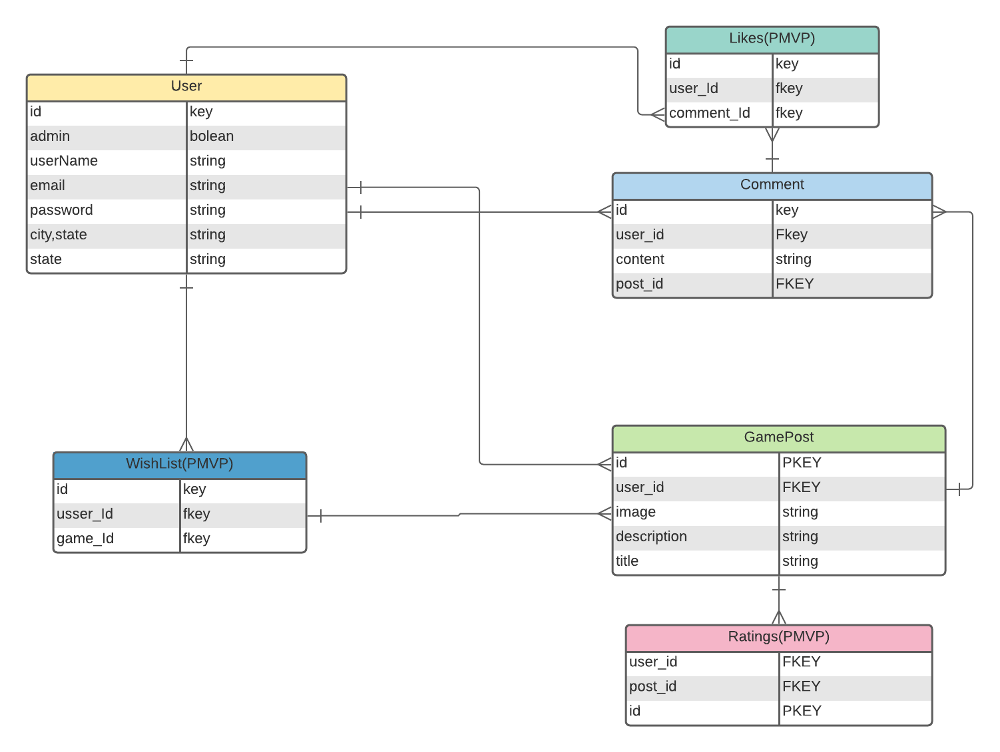

# Hail: Gaming Blog

### By: Sam'an Khaliq, Robert Thome, & Zitai Haung
Sam'an: [GitHub](https://github.com/SamanGriffiths47) | [LinkedIn](https://www.linkedin.com/in/saman-khaliq/) | [Portfolio](https://www.samankhaliq.com/)

Robert Thome: [GitHub](https://github.com/robertthome) | [LinkedIn](https://www.linkedin.com/in/robertthome/)

Zitai Haung: [GitHub](https://github.com/Zitai01) | [LinkedIn](https://www.linkedin.com/in/zitai-huang/)

[DeployedSite](https://hail-gaming.herokuapp.com/)

***

### ***Discription***

#### Hail is a kind of gaming social media site, wherein video game lovers of all kinds can congregate to appreciate (or deprecate :stuck_out_tongue_winking_eye:) their favorite games 

### ***Technologies used***

### ***Getting Started***

Register and sign in to the gameing blog where you will have access to a collection of games and join in on the discussion. Please follow community guidlines and respect your fellow gamers in the comment sections.

***

### ***ERD***

### ***Hierarchy Diagram***

.png)

## Screenshots of the Website

#### Landing Page

#### Newsfeed

#### Comment Section

### ***Future Updates***

- [x] Finish Styling
- [x] User Page
- [x] Working Search
- [ ] Wishlist
- [ ] Light Mode